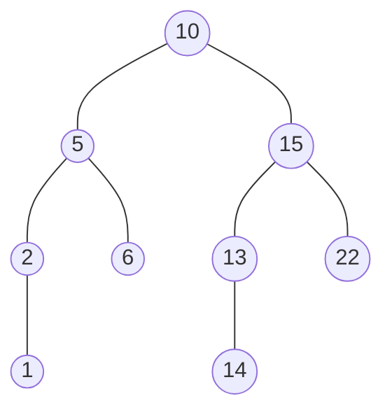

# 二叉查找树的定义

* 每个节点之多只有两个分支节点, 且分为左边和右边. 因为左右分支, 且左侧小于右边. 查找时就可以折半
* 左边的分支节点必须小于右边的分支节点. 比如 10 左边的所有节点都要小于 10, 10 右边的所有节点都要大于 10





需要实现三个方法: Insertion, Searching, Deletion 
算法有 average case 和 worst case

Average Case: Time O(log n)
Worst Case: Time O(n)
如果用迭代方法和递归算法 Space 消耗不同. 如果用递归算法, 栈的深度很高. O(N), 如果是迭代算法, 则是 O(1)
删除
1. 删除左右分支都存在的节点(包含根节点)
2. 删除只有单支的节点
	1. 根节点
	2. 非根节点

```python 

class BST:
    def __init__(self, value) -> None:
        self.value = value
        self.left = None
        self.right = None

    # Average time: O(log(n)) space: O(1) 
    def insert(self, value): 
        currentNode = self  # 这里就是根节点
        while True:
            if value < currentNode.value:
                if currentNode.left is None:
                    currentNode.left = BST(value) # 用递归方式定义
                    break
                else:
                    currentNode = currentNode.left
            else:
                if currentNode.right is None:
                    currentNode.right = BST(value) # 每个子节点也是一棵树
                    break
                else:
                    currentNode = currentNode.right
        return self  # 这样可以用链式法则来调用
    
    def contains(self, value):
        current_node = self
        while current_node is not None:
            if value < current_node.value:
                current_node = current_node.left
            elif value > current_node.value:
                current_node = current_node.right
            else:
                return True
        return False
    

    def remove(self, value, parentNode = None):
        currentNode = self
        while currentNode is not None: # 一直找到叶子节点
            # find the value you are tring to remove
            if value < currentNode.value:
                parentNode = currentNode
                currentNode = currentNode.left
            elif value > currentNode.value:
                parentNode = currentNode
                currentNode = currentNode.right
            else: #  currentNode 就是目标节点
                if currentNode.left is not None and currentNode.right is not None: # 目标节点左右分支节点都存在, 可以是根节点
                    currentNode.value = currentNode.right.getMinValue() # 用右侧分支最小的值来取代节点
                    currentNode.right.remove(currentNode.value, currentNode)  # 递归调用, 删除右侧最小的叶子节点
                elif parentNode is None:  # 只有左边分支的根节点
                    if currentNode.left is not None:
                        currentNode.value = currentNode.left.value
                        currentNode.right = currentNode.left.right
                        currentNode.left = currentNode.left.left

                    elif currentNode.right is not None:
                        currentNode.value = currentNode.right.value
                        currentNode.left = currentNode.right.left
                        currentNode.right = currentNode.right.right
                    
                    else:
                        # 如果只有一个root节点
                        currentNode.value = None

                elif parentNode.left == currentNode: # 目标节点是父节点的左分支
                    parentNode.left = currentNode.left if currentNode.left is not None else currentNode.right
                elif parentNode.right == currentNode:   # 目标节点是父节点的右分支
                    parentNode.right = currentNode.left if currentNode.left is not None else currentNode.right
                break # 必须有, 不然走到哪个叶子节点才停
        return self

    def getMinValue(self):
        currentNode = self
        while currentNode.left is not None:
            currentNode = currentNode.left
        return currentNode.value

```