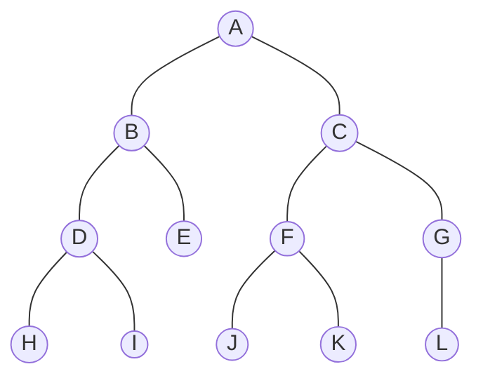
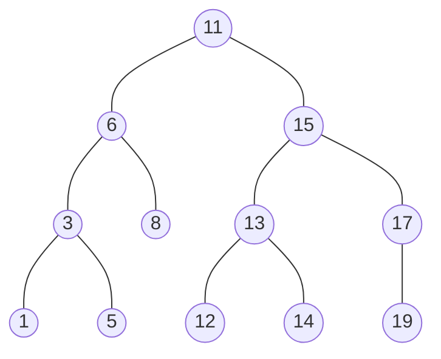

[参考视频](https://www.youtube.com/watch?v=k7GkEbECZK0) 
1. 模拟了元素进栈和出栈的过程


preorder 用的是stack
```python
def preOrderTraverse(tree, array):
	if tree is not None:
		array.append(tree.value)
		preOrderTraverse(tree.left, array)
		preOrderTraverse(tree.right, array)

# order: A, B, D, H, I, E, C, F, J, K, G, L

```

inorder 用stack
如果是数字的节点， 这个种遍历的方式， 可以把排好序的数列输出
```python
def inOrderTraverse(tree, array):
	if tree is not None:
		inOrderTraverse(tree.left, array)
		array.append(tree.value)
		inOrderTraverse(tree.right, array)
	return array

# inorder: H, D, I, B, E, A, J, F, K, C, G, L
``` 





```python
# inorder: 1, 2, 5, 6, 8, 11, 12, 13, 14, 15, 17, 19
```

postorder 用stack
```python
# time: O(n) space: O(n)
def postOrderTraverse(tree, array):
	if tree is not None:
		postOrderTraverse(tree.left, array)
		postOrderTraverse(tree.right, array)
		array.append(tree.value)

# postorder: 1, 5, 3, 8, 6, 12, 14, 13, 19, 17, 15, 11
```

Breadth First Search (BFS) or Level order
需要使用到Queue

```python

# order: 11, 6, 15, 3, 8, 13, 17, 1, 5, 12, 14, 19
```


```python

def 
```