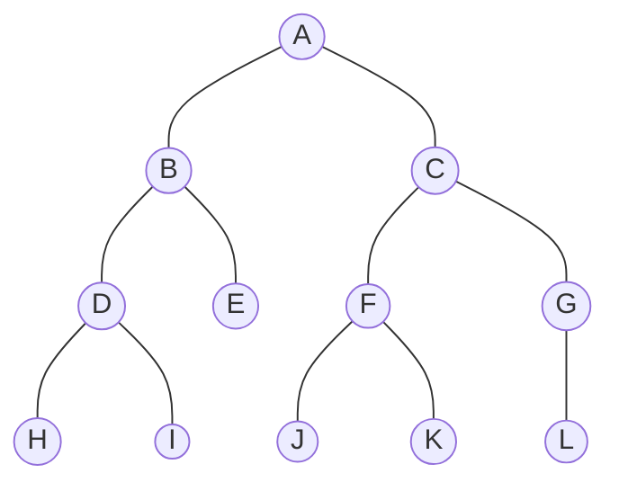
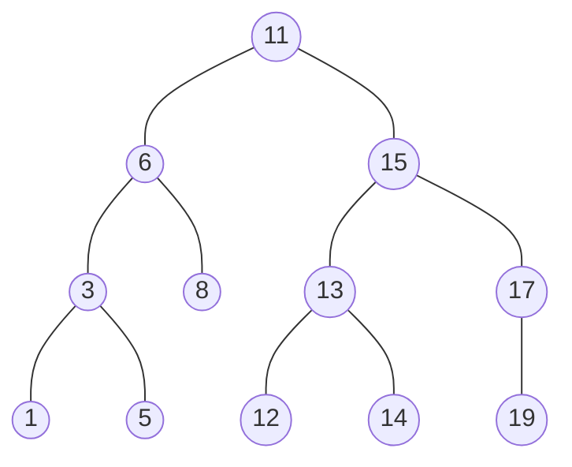

[参考视频](https://www.youtube.com/watch?v=k7GkEbECZK0)


```mermaid
graph TD
	root((A)) --- B((B))
	root((A)) --- C((C))
	B((B)) --- D((D))
	B((B)) --- E((E))
	D((D)) --- H((H))
	D((D)) --- I((I))
	C((C)) --- F((F))
	C((C)) --- G((G))
	G((G)) --- L((L))
	F((F)) --- J((J))
	F((F)) --- K((K))
```
preorder 用的是stack
```python
def preorder(node):
	if not node: return
	print(node.value)
	preorder(node.left)
	preorder(node.right)

# order: A, B, D, H, I, E, C, F, J, K, G, L

```

inorder 用stack
如果是数字的节点， 这个种遍历的方式， 可以把排好序的数列输出
```python
def inorder(node):
	if not node: return
	inorder(node.left)
	print(node.value)
	inorder(node.right)

# inorder: H, D, I, B, E, A, J, F, K, C, G, L
``` 



```mermaid
graph TD
	node_11((11)) --- node_6((6))
	node_11((11)) --- node_15((15))
	node_6((6)) --- node_3((3))
	node_6((6)) --- node_8((8))
	node_3((3)) --- node_1((1))
	node_3((3)) --- node_5((5))
	node_15((15)) --- node_13((13))
	node_15((15)) --- node_17((17))
	node_13((13)) --- node_12((12))
	node_13((13)) --- node_14((14))
	node_17((17)) --- node_19((19))
```


```python
# inorder: 1, 2, 5, 6, 8, 11, 12, 13, 14, 15, 17, 19
```

postorder 用stack
```python
def postorder(node):
	if not node: return
	postorder(node.left)
	postorder(node.right)
	print(node.value)

# postorder: 1, 5, 3, 8, 6, 12, 14, 13, 19, 17, 15, 11
```

Breadth First Search (BFS) or Level order
需要使用到Queue

```python

# order: 11, 6, 15, 3, 8, 13, 17, 1, 5, 12, 14, 19
```