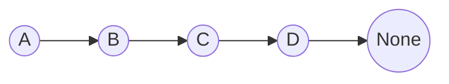

单向链表

定义
```python
class Node:
    def __init__(self, value) -> None:
        self.value = value
        self.next_node = None
    
    def __repr__(self) -> str:
        return self.value


node_a = Node('A')
node_b = Node('B')
node_c = Node('C')
node_d = Node('D')

node_a.next_node = node_b
node_b.next_node = node_c
node_c.next_node = node_d


# 遍历单向链表

cur_node = node_a
while cur_node.next_node is not None:
    print(cur_node)
    cur_node = cur_node.next_node
    
```


# Double Linked List
为什么要双向链表？因为双向链表既可以从头往后遍历，也可以从后往前遍历
双向链表需要实现哪些功能？
双向链表是由head和tail

需求：
1. 给链表添加一个元素
2. 删除链表中的元素
3. 将某一个元素设置为链表的头部
4. 找到表中某个元素然后删除
5. 三种insert方式： 插入在某个元素前面，插入在某个元素后面， 插入在某个position上

实现
1. 区分head和tail
	head: 它不是任何元素的next
	tail： 它不是任何元素的prev
2. 删除指定元素时，先把前后元素关联上。如果先删除指定元素，在链表会被打断