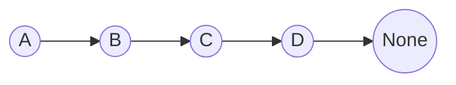

### 单向链表
- 单向链表有 Head 和 Tail

节点的定义
```python
class Node:
    def __init__(self, data=None, next=None):
        self.data = data
        self.next = next


class LinkedList:
    def __init__(self):
        self.head = None

    def add_node(self, data): 
	    """insert in the head"""
        new_node = Node(data)
        new_node.next = self.head
        self.head = new_node
        
	def append_node(self, data)
		"""Insert at the end"""
		new_node = Node(data)
		if self.head is None:
			self.head = new_node # 如果链表是空的
			return
		current_node = self.head
		while current_node.next:
			current_node = current_node.next
		current_node.next = new_node

    def remove_node(self, data):
        current_node = self.head
        previous_node = None

        while current_node is not None:
            if current_node.data == data:
                if previous_node is not None:
                    previous_node.next = current_node.next
                else:
                    self.head = current_node.next
                return True
            previous_node = current_node
            current_node = current_node.next

        return False

    def traverse_list(self):
        current_node = self.head
        while current_node is not None:
            print(current_node.data)
            current_node = current_node.next
		
```

## Reverse linked list

1. prev, cur, next 指向三个元素, 其中 prev 是空
2. 每次迭代移动着三个指针, 知道 cur等于 None, prev 是最后一个元素
```python
# 迭代方法
def reverse_list(head):
	if head.next_node is None:
		return head
	prev = None
	cur = head
	while cur is not None: 
		next = cur.next_node
		cur.next_node = prev
		prev = cur
		cur = next
	return pre   # 注意因为循环结束的条件是 cur is None, 此时 prev 是 head
	

# 递归方法
def reverse_list(head, prev=None):
	if head is None:
		return pre
	next = head.next_node
	head.next_node = prev
	return reverse_list(next, head)
	
```

# Double Linked List
为什么要双向链表？因为双向链表既可以从头往后遍历，也可以从后往前遍历
双向链表需要实现哪些功能？
双向链表是由head和tail

需求：
1. 给链表添加一个元素
2. 删除链表中的元素
3. 将某一个元素设置为链表的头部
4. 找到表中某个元素然后删除
5. 三种insert方式： 插入在某个元素前面，插入在某个元素后面， 插入在某个position上

实现
1. 区分head和tail
	head: 它不是任何元素的next
	tail： 它不是任何元素的prev
2. 删除指定元素时，先把前后元素关联上。如果先删除指定元素，在链表会被打断