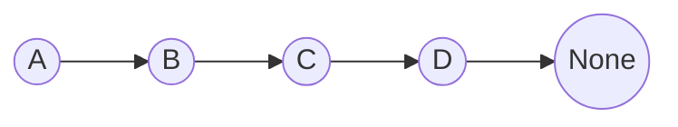

单向链表

```mermaid
graph LR 
A((A)) --> B((B)) --> C(( C )) --> D(( D )) --> E(( None ))
```
节点的定义
```python
class Node:
    def __init__(self, value) -> None:
        self.value = value
        self.next_node = None
    
    def __repr__(self) -> str:
        return self.value


node_a = Node('A')
node_b = Node('B')
node_c = Node('C')
node_d = Node('D')

node_a.next_node = node_b
node_b.next_node = node_c
node_c.next_node = node_d


# 迭代方法打印链表
def print_linked_list(head):
	cur_node = head
	while cur_node.next_node is not None:
	    print(cur_node)
	    cur_node = cur_node.next_node

# 用递归的方式打印链表
def print_linked_list(head):
	if head is None:
		return
	print(head)
	print_linked_list(head.next_node)

# 找到链表中的第 n 个 元素并返回它的值
# 迭代方法
def get_node_value(head, index):
	cur = head
	while index > 0:
		cur = cur_next_node
		index -= 1
	return cur.value

# 递归方法
def get_node_value(head, index):
	if head is None:
		return
	if index == 0:
		return head.value
	return get_node_value(head.next_node, index - 1)
    
```

## reverse linked list
### 思维
1. prev, cur, next 指向三个元素, 其中 prev 是空
2. 每次迭代移动着三个指针, 知道 cur等于 None, prev 是最后一个元素
```python
# 迭代方法
def reverse_list(head):
	if head.next_node is None:
		return head
	prev = None
	cur = head
	while cur is not None: 
		next = cur.next_node
		cur.next_node = prev
		prev = cur
		cur = next
	return pre   # 注意因为循环结束的条件是 cur is None, 此时 prev 是 head
	

# 递归方法
def reverse_list(head, prev=None):
	if head is None:
		return pre
	next = head.next_node
	head.next_node = prev
	return reverse_list(next, head)
	
```


# Double Linked List
为什么要双向链表？因为双向链表既可以从头往后遍历，也可以从后往前遍历
双向链表需要实现哪些功能？
双向链表是由head和tail

需求：
1. 给链表添加一个元素
2. 删除链表中的元素
3. 将某一个元素设置为链表的头部
4. 找到表中某个元素然后删除
5. 三种insert方式： 插入在某个元素前面，插入在某个元素后面， 插入在某个position上

实现
1. 区分head和tail
	head: 它不是任何元素的next
	tail： 它不是任何元素的prev
2. 删除指定元素时，先把前后元素关联上。如果先删除指定元素，在链表会被打断