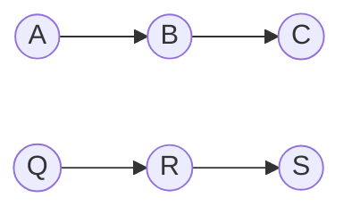
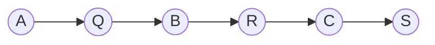

将两个链表合并为一个

和并为


```python
# input 
node_a = Node('A')
node_b = Node('B')
node_c = Node('C')
node_a.next_node = node_b
node_b.next_node = node_c

node_q = Node('Q')
node_r = Node('R')
node_s = Node('S')
node_q.next_node = node_r
node_r.next_node = node_s

```
### 方法一
1. 两个链表只用一个 cur 指针

```python
def zip_linked_list(head_a, head_b):
	head_of_two = head_a
	if head_a is None:
		return head_b
	if head_b is None:
		return head_a
	while head_a is not None and head_b is not None:
		next_a = head_a.next_node
		head_a.next_node = head_b
		next_b = head_b.next_node
		head_b.next_node = next_a

		head_a = next_a
		head_b = next_b
	return head_of_two 

zipped_linked_list = zip_linked_list(node_a, node_q)

```

### 方法二

1. 两个链表各自用一个 cur_node 指针遍历

```python
# time: O(min(n, m))
def zip_linked_list_2(head1, head2):
    tail = head1
    cur_1 = head1.next_node
    cur_2 = head2
    count = 0
    while cur_1 is not None and cur_2 is not None:
        if count % 2 == 0:
            tail.next_node = cur_2
            cur_2 = cur_2.next_node
        else:
            tail.next_node = cur_1
            cur_1 = cur_1.next_node
        tail = tail.next_node 
        count += 1
    
    if cur_1 is not None:
        tail.next_node = cur_1
    if cur_2 is not None:
        tail.next_node = cur_2

    return head1


node_a = Node('A')
node_b = Node('B')
node_c = Node('C')
node_a.next_node = node_b
node_b.next_node = node_c


node_q = Node('Q')
node_r = Node('R')
node_s = Node('S')
node_q.next_node = node_r
node_r.next_node = node_s

zipped_linked_list = zip_linked_list_2(node_a, node_q)

print_linked_list(zipped_linked_list)
```