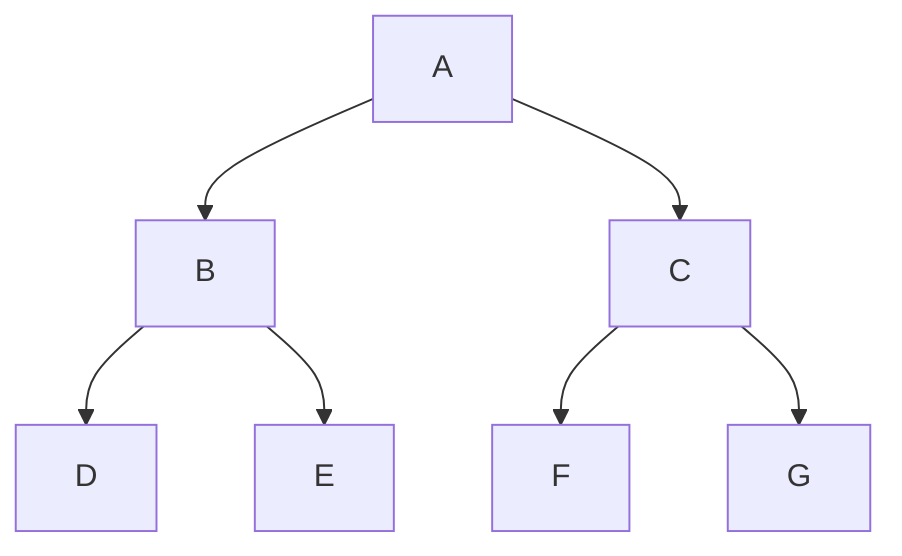

# 名词解释
node: 也称为 vertex
root node: 一棵树只有一个根节点
edge: 每个节点的上面只有一个父节点. 从 root node 到达指定节点只有一条path
branch: 从根节点出发, 到达末端叶子节点的路径
完全二叉树: 每个节点都有且只有两个子节点

```mermaid
graph TB
	A --> B
	A --> C
	B --> D
	B --> E
	C --> F
	C --> G
```
