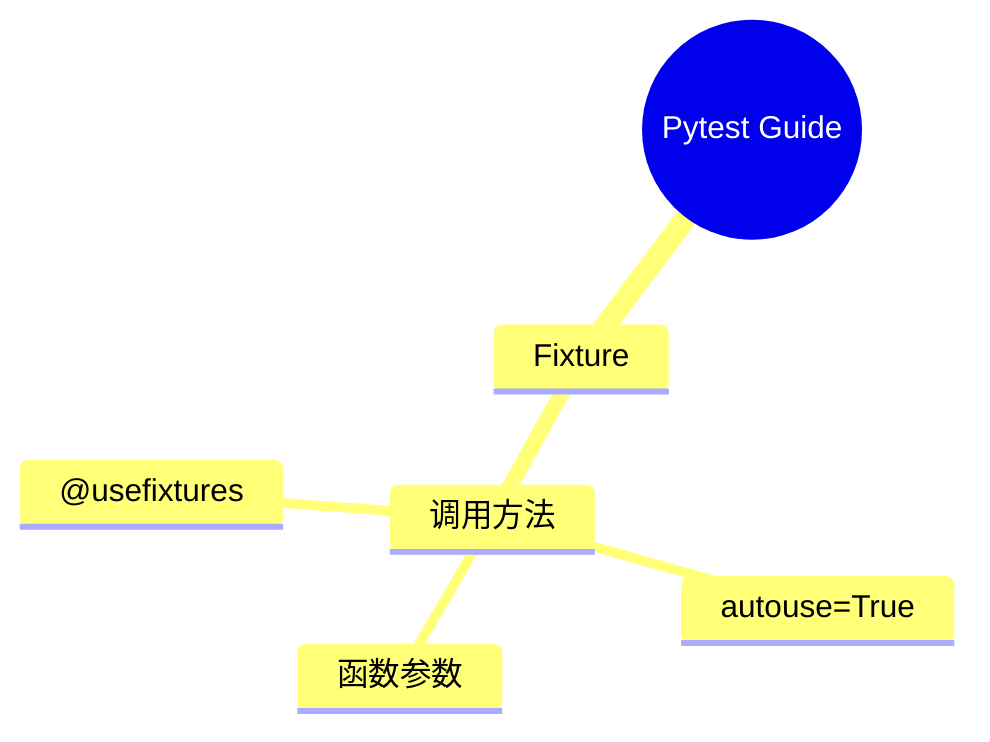

# Pytest Guide

## Overview
Pytest is a mature full-featured Python testing framework that makes it easy to write simple and scalable test cases. It requires less boilerplate than unittest and supports fixtures, parameterized testing, and plugins.

## Key Concepts
- Test files start with `test_` and test functions start with `test_`
- Uses plain Python `assert` instead of `self.assertEqual()`
- `@pytest.fixture` for creating reusable test objects
- `yield` in fixtures for setup/teardown pattern
- `pytest.raises()` for testing exceptions
- Supports `@patch` from `unittest.mock` for mocking

## Details

### Module Installation

```shell
# === Install Pytest ===
pip install pytest
uv add pytest
```

### Test File Convention
1. pytest的文件同样用 `test_` 开头
2. pytest 不需要继承TestCase，只要定义函数用 `test_` 开头
3. 函数中直接用Python关键词assert，不像Unittest中用self.assert
4. 在一个测试函数中可以写多个assert

```python
def test_foo():
    assert 1 == 1
    assert 2 == 2
```

### Testing Exceptions

```python
def divide(x, y):
	if y == 0:
		raise ValueError("cannot divide by zero")
	return x / y


def test_divide_by_zero():
    with pytest.raises(ValueError) as e_info:  # 指定某一种exception
        divide(5, 0)  # function will raise ValueError
    assert str(e_info.value) == "cannot divide by zero"
```

### Using Fixture to Setup and Teardown

```python
import sqlite3
import pytest


def get_user_by_email(db, email):
    return db.execute(
        "SELECT id, name, email FROM users WHERE email = ?",
        (email,),
    ).fetchone()


@pytest.fixture
def db():
    # Setup: create an isolated in-memory test database
    connection = sqlite3.connect(":memory:")

    connection.execute("""
        CREATE TABLE users (
            id INTEGER PRIMARY KEY,
            name TEXT NOT NULL,
            email TEXT NOT NULL UNIQUE
        )
    """)

    connection.execute(
        "INSERT INTO users (name, email) VALUES (?, ?)",
        ("Alice", "alice@example.com"),
    )
    connection.commit()

    yield connection  # Tests run here

    # Cleanup: executed after each test
    connection.close()


def test_get_existing_user(db):
    user = get_user_by_email(db, "alice@example.com")

    assert user is not None
    assert user[1] == "Alice"
    assert user[2] == "alice@example.com"


def test_get_missing_user(db):
    user = get_user_by_email(db, "missing@example.com")

    assert user is None
```
### Setup & Teardown with yield

```python
import pytest

@pytest.fixture
def setup_teardown():
    print('setup')
    yield
    print('teardown')

# 第一种加载方式: 函数参数注入
def test_setup_teardown(setup_teardown):
    print('in test')

# 第二种加载方式: @pytest.mark.usefixtures
@pytest.mark.usefixtures('setup_teardown')
def test_g(c_instance):
    assert c_instance.g() == 2

# 第三种加载方式: autouse=True (所有测试函数隐性执行)
@pytest.fixture(autouse=True)
def setup_teardown():
    print('setup')
    yield
    print('teardown')
```

一个测试函数可以接受多个fixture

### Run Test Commands

```shell
# run all tests under current directory
python -m pytest
uv run pytest  # run with uv

# suppress warnings
python -m pytest -p no:warnings

# run tests matching a keyword expression
python -m pytest -k read

# run only the last failed tests
python -m pytest --lf

# run tests matching specific expression
python -m pytest -k "summary and not test_read_summary"

# stop after first failure
python -m pytest -x

# enter PDB after first failure
python -m pytest -x --pdb

# stop after two failures
python -m pytest --maxfail=2

# show local variables in tracebacks
python -m pytest -l

# list the 2 slowest tests
python -m pytest --durations=2
```

## Code Examples

### Using Mock with Pytest

```python
from unittest.mock import patch
from len_joke import len_joke


@patch("len_joke.get_joke")
def test_len_joke(mock_get_joke):
    mock_get_joke.return_value = "one"
    assert len_joke() == 3
```

### Using MagicMock with Pytest

```python
import requests

def get_joke():
    response = requests.get("https://api.icndb.com/jokes/random")
	
    if response.status_code == 200: # 返回值的属性值, 在构造模拟结果实例化的时候作为参数
        data = response.json() # 返回值的方法的结果, 用 .return_value 
        return data["value"]["joke"]

    return None
```
测试函数

```python
from unittest.mock import patch, MagicMock


@patch("main.requests")
def test_get_joke(mock_requests): # 构造一个模拟函数来替换 mock_requests
	# 构建模拟函数的返回值
    mock_response = MagicMock(status_code=200)
    mock_response.json.return_value = {"value": {"joke": "one"}}
    # 将模拟的函数, 和模拟函数的返回值关联起来
    mock_requests.get.return_value = mock_response
    assert get_joke() == "one"
```

### Retry Logic with side_effect (Real-world Example)

```python
import time
from unittest.mock import MagicMock

# real function that retries on failure
def fetch_data_with_retry(api_client):
    for attempt in range(3):
        try:
            return api_client.get_data()
        except ConnectionError:
            if attempt == 2:
                raise
            time.sleep(1)

# test: simulate fail → fail → succeed
def test_retry_logic():
    mock_client = MagicMock()
    mock_client.get_data.side_effect = [
        ConnectionError("timeout"),           # 1st call: fails
        ConnectionError("timeout"),           # 2nd call: fails
        {"status": "ok", "data": [1, 2, 3]}, # 3rd call: succeeds
    ]

    result = fetch_data_with_retry(mock_client)
    assert result == {"status": "ok", "data": [1, 2, 3]}
    assert mock_client.get_data.call_count == 3
```

### Database Fixture with setup/teardown

```python
import pytest

@pytest.fixture
def db_connection():
    # setup
    conn = open_database_connection()
    yield conn
    # teardown
    conn.close()

def test_query(db_connection):
    result = db_connection.query("SELECT 1")
    assert result is not None
```
### Mocking External Services (SMTP Email Example)

```python
# ============ email_sender.py (the real code to test) ============
import smtplib

def send_email(recipient, message):
    """
    This function connects to a REAL SMTP server.
    We must mock it during testing to avoid actually sending emails.
    """
    server = smtplib.SMTP("smtp.gmail.com", 587)
    server.starttls()
    server.login("my_email@gmail.com", "password")
    server.sendmail("my_email@gmail.com", recipient, message)
    server.quit()


# ============ test_email_sender.py (the test) ============
from unittest.mock import patch, MagicMock

# Mock smtplib.SMTP so it NEVER connects to Gmail
@patch("smtplib.SMTP")
def test_send_email(mock_smtp):
    # mock_server: a fake SMTP server object
    # In the real code: server = smtplib.SMTP(...) returns a server object
    # Then we call server.sendmail(...) on that object
    mock_server = MagicMock()
    mock_smtp.return_value = mock_server  # SMTP() returns our fake server

    send_email("user@example.com", "Hello")

    # Verify SMTP was called with correct host and port
    mock_smtp.assert_called_once_with("smtp.gmail.com", 587)
    # Verify sendmail was called on the returned server object
    mock_server.sendmail.assert_called_once()
```
## Summary
Pytest is the recommended testing framework for Python. It reduces boilerplate compared to unittest, uses simple `assert` statements, provides powerful fixtures with setup/teardown support via `yield`, integrates seamlessly with `unittest.mock` for mocking, and supports parameterized testing for comprehensive test coverage.

## Mindmap



## Related Notes
- [[Python/Python Test.md|Python Test]]
- [[Design Pattern/Roadmap for Design Pattern.md|Design Pattern Learning Path]]
