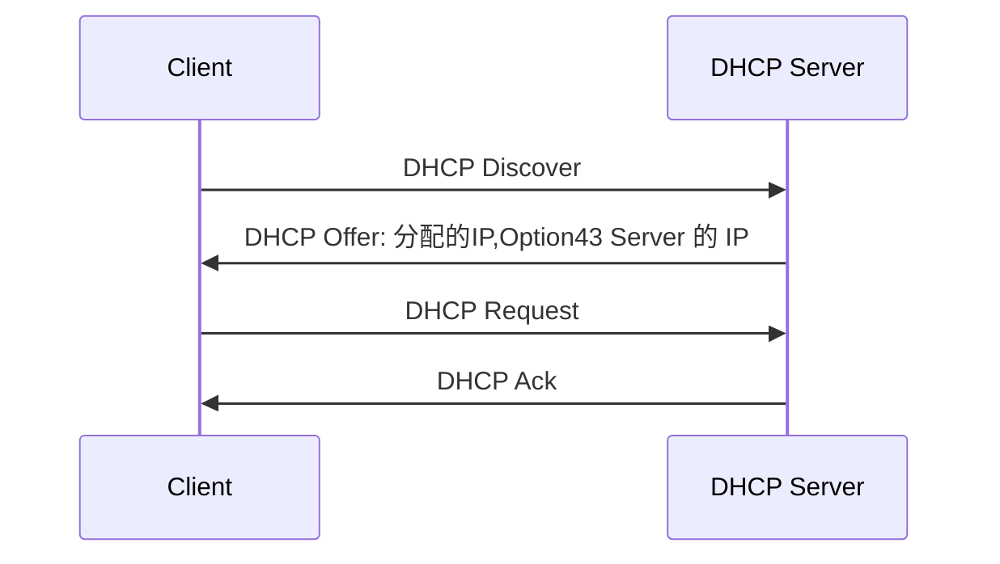

DHCP 流程
1. Client 发送 DHCP Discovery 广播
2. DHCP Server 发送 DHCP Offer 单播 携带分配的 IP 地址, 服务器的 IP 地址(Option43 包括DNS, email服务器地址, 网关, AC, 云管平台等信息) 
3. 客户发送 DHCP Request 广播. 因为网络中可能存在多个DHCP服务器给我发了offer, 所以我要广播一下我决定使用那个Offer中IP. 然后其他DHCP服务器就会收回发给的我offer中的IP地址(一般情况下谁先来就用谁的)
4. 真正的DHCP, 会保留发送的IP地址和租期, 服务器发送 DHCP Ack



当租期用了一半时, 客户端会重发 DHCP Request 单播, 向服务器请求继续使用IP地址, 延长租期. 如果客户端因为断电或者服务器问题错过了第一次续租, 会等到租期的87.5%的时候, 会再发送一次DHCP Request

一般客户端正常关闭时会释放租期. 


# DHCP 客户端

```shell
int g0/0/1
ip address dhcp-alloc
```
# DHCP 服务器

### 使用接口网段为地址池

```shell
dhcp enable
int g0/0/0 # 可以直接在物理口下做, 也能在vlanif下做
ip add 192.168.1.254 255.255.255.0
dhcp server excluded-ip-address 192.168.1.100 192.168.1.199 # 保留,不分出去
dhcp server dns-list 8.8.8.8  # 配置dns
dhcp selelct interface  # 这里interfacw指接口的地址池

```

### 配置全局地址池
```shell
dhcp enable
ip pool office
network 10.1.1.0 mask 255.255.255.128
dns-list 8.8.8.8
gateway-list 10.1.1.1
lease day 10
quit

# 调用地址池
interface vlanif 10
ip add 10.1.1.1 24
dhcp select global # 这里global指全局地址池

```

### DHCP 中继
DHCP 中继是一种常见的技术
因为路由器隔绝广播域, 所以如果要使DHCP dicover 穿越路由器, 或者三层交换机的vlanif, 就要把三层交换机或者路由器配置成DHCP 中继. 把广播变成指向DHCP服务器的单播. 

在网络中也可以使用服务器来做 DHCP Server
中继设备配置
```shelldhcp enable
int g0/0/0
dot1q termination vid 20
ip add 192.168.20.1 255.255.255.0
arp broadcast enable
dhcp select relay  # 入方向
dhcp relay server-ip 23.1.1.3 # 指向 dhcp 服务器地址
```

注意: 如果是子接口或者vlanif口, 则在子接口和vlanif口下配置 

服务器配置
```shell

ip pool vlan 20 
network 192.168.20.0 mask 24
gateway-list 192.168.20.1 
dns-list 114.114.114.114 8.8.8.8 # 可以放多个
lease day 0 hour 8  # 8 小时, 默认是1天
option # 

ip pool vlan 30
network 192.168.30.0 mask 24
gateway-list 192.168.30.1 
dns-list 114.114.114.114
lease day 0 hour 8  # 8 小时, 默认是1天
option # 

int g0/0/0  # 服务器的目标接口
dhcp select global # 全局地址池 使用2个, 根据relay的源地址所在网段来分配

```


### Windows DHCP 客户端
windos DHCP 客户端一共会收到四个 IP 地址
1. 主机 IP 地址
2. 掩码
3. 网关 IP 地址
4. DNS IP 地址
windows主机在初次启动时, 如果采用DHCP获取IP地址, 那么第一个发送的数据包中的源IP是0.0.0.0 如果获取不到ip, 则使用169.254.2.33做为自己的ip地址


DHCP 容易引发的故障
在一个DHCP的网络中，广播网络中， 如果设置了几个固定IP地址，在网络设备重启后， 重新分配IP地址后， 可能会和固定的IP地址产生冲突， 造成在固定IP地址上配置的服务无法访问。 
案例：
在监控设备的vlan中， 摄像头的IP地址是DHCP获取的。 但是摄像头的服务器是固定IP的。 DHCP的服务端如果发生重启， 则会重新给摄像头分配IP地址，造成IP地址冲突，服务器IP地址漂移。 


# 华为交换机 DHCP IP MAC 地址绑定

```shell
# 回收已经被分配的 IP 地址
reset ip pool interface valn22 192.168.45.170

# 清楚 mac 地址对应 ARP 表
reset arp dynamic ip 192.168.45.170

# 在地址池中绑定 mac 地址
interface vlan22
dhcp server static-bind ip-address 192.168.45.170 mac-address 0050-58ac-111e


# 查看 DHCP 地址池分配情况
display ip pool interface vlan22 all


```