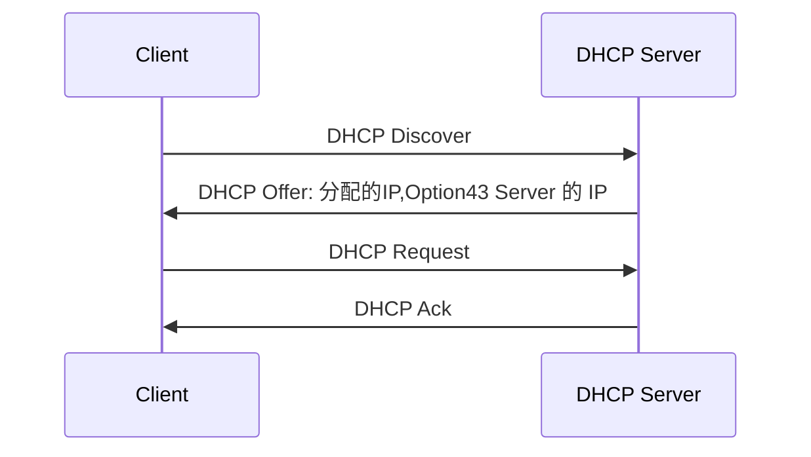

DHCP 流程
1. Client 发送 DHCP Discovery 广播
2. DHCP Server 发送 DHCP Offer 单播 携带分配的 IP 地址, 服务器的 IP 地址(Option43) 
3. 客户发送 DHCP Request 广播
4. 服务器发送 DHCP Ack

```mermaid
sequenceDiagram
    participant C as Client
    participant S as DHCP Server
    C->>S: DHCP Discover 
    S->>C: DHCP Offer: 分配的IP,Option43 Server 的 IP
    C->>S: DHCP Request
    S->>C: DHCP Ack
    
```

