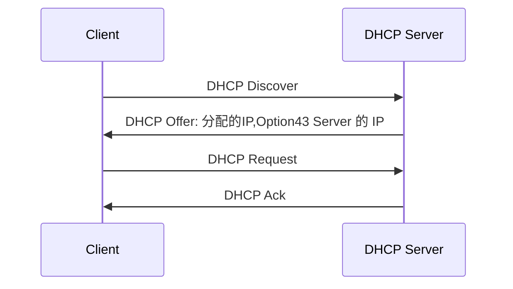

DHCP 流程
1. Client 发送 DHCP Discovery 广播
2. DHCP Server 发送 DHCP Offer 单播 携带分配的 IP 地址, 服务器的 IP 地址(Option43 包括DNS, email服务器地址, 网关, AC, 云管平台等信息) 
3. 客户发送 DHCP Request 广播. 因为网络中可能存在多个DHCP服务器给我发了offer, 所以我要广播一下我决定使用那个Offer中IP. 然后其他DHCP服务器就会收回发给的我offer中的IP地址
4. 真正的DHCP, 会保留发送的IP地址和租期, 服务器发送 DHCP Ack


```mermaid
sequenceDiagram
    participant C as Client
    participant S as DHCP Server
    C->>S: DHCP Discover 
    S->>C: DHCP Offer: 分配的IP,Option43 Server 的 IP
    C->>S: DHCP Request
    S->>C: DHCP Ack
    
```

当租期用了一半时, 客户端会重发 DHCP Request 单播, 向服务器请求继续使用IP地址, 延长租期. 如果客户端因为断电或者服务器问题错过了第一次续租, 会等到租期的87.5%的时候, 会再发送一次DHCP Request

一般客户端正常关闭时会释放租期. 


# 配置方法


简单方式
```shell
dhcp enable
int g0/0/0
ip add 192.168.1.1 255.255.255.0
dhcp select interface
dhcp server excluded-ip-address 192.168.1.100 192.168.1.199
dhcp server dns-list 8.8.8.8


```


DHCP 中继
因为路由器隔绝广播域, 所以如果要使DHCP dicover 穿越路由器, 需要在沿途路由器上配置DHCP 中继

```shell
dhcp enable
int g0/0/0
dot1q termination vid 20
ip add 192.168.20.1 255.255.255.0
arp broadcast enable
dhcp select relay  # 入方向
dhcp relay server-ip 23.1.1.3 # 指向 dhcp 服务器地址
```


