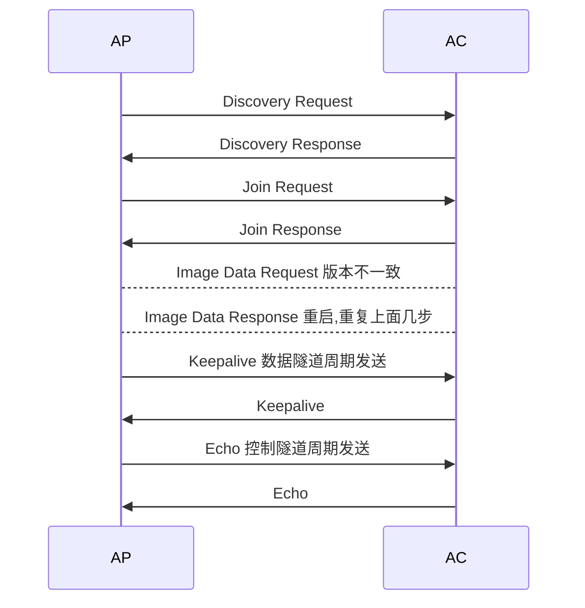
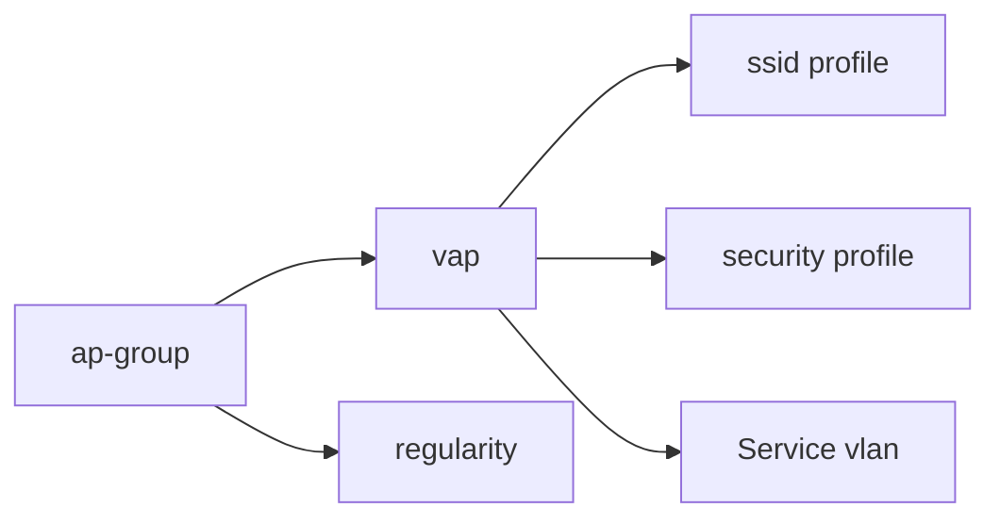

# 概念
### WLAN
WLAN的技术出了WiFi之外, 还包括有蓝牙, zigbee(一种物联网技术), 等
Wifi是IEEE802.11技术的一种实现. 

### 名词解释

**STA 无线终端**
```shell
# hawei 查看无线终端的命令
display station all 
```
信道: 传输介质
信宿: AP. AP 可以理解是Hub, 所以一个终端收到的信号, 会被辐射给其他的终端
WLAN Wireless Local Network 是无线局域网, 应用在企业网中. 和无线广域网技术没有关系
WLAN 约等于 wifi = 802.11 是IEEE发布的关于二层无线通信的标准
ZTP: 零配置开局


### 802.11技术发展

802.11 本质上属于二层数据链路层和物理层技术, 网络层依旧使用 IP
物理层: 空气中传输的比特率, 频段
链路层: 信道接入, 寻址, 数据帧校验, 错误检测, 安全机制

#### 802.11技术的演进
在不同的版本中, 关注点在于
1. 带宽
2. 时延
3. 工作频段

* 802.11b  WiF2 速率只有 11Mbps .  频段 2.4GHz 那个时代的无线 AP 类似 hub, 进支持半双工. 当用户越多时, 带宽会原来越低
* 802.11a  WIFI3 速率54Mbps. 频段 5GHz
* 802.11g  WIFI3 速率54Mbps. 频段 2.4 GHz
* 802.11n 理论速率600Mbps  Wifi 4, 频段 2.4GHz 或 5GHz. 实际下载速度是几十兆
* 802.11ac Wave1  WIFI 5 频段 5GHz, 速率 1.3Gbps -- 企业主流, 号称千兆WIFI, 下载速度在100兆字节每秒
* 802.11ac Wave2 WIFI 6 频段在 5GHz, 速率 3.47Gbps  --企业主流 
* 802.11ax WIFI 6 频段在 2.4GHz 或 5GHz,速率 10Gbps

#### 降标准的现实场景
这些标准定义了AP和STA之间通信的标准, 也就是说如果STA的无线网卡比较老旧, 只支持802.11n, 那么即使无线AP支持802.11ac, 经过协商后, 还是会使用802.11n的标准来通信

查看当前无线终端的wifi标准
![[Pasted image 20231021133357.png]]
#### 企业跨越wifi5演进
因为wifi5不能工作在2.4频段. 而wifi4 和 wifi6都支持2.4频段. 所以有些企业跳过了wifi5直接演进到wifi6
#### wifi5和wifi6在带宽差距上时10倍
虽然wifi5在理论上的带宽可以达到3.47Gbps, 但是最好的厂家在实现后, 能达到的带宽还不足一个Gbps. 而wifi6上, 华为已经可以实现9.6Gbps的带宽. 所以在实际使用中, wifi6的带宽是wifi5的10倍
且wifi6相比wifi5 支持更多的用户数量
# 产品和工程应用场景

### 交换机接口速度小于无线路由器接口
如果交换机接口的速率低于无线路由器的接口, 造成无法享受满速的无线带宽. 所以要使用 Wifi6, 就需要更换交换机. 华为提供了多速率端口的交换机. 一个端口可以配置 5G 和 2.5G, 可以适配 802.11ac Wave2 和 Wave 1

### AR VR场景对带宽的需求
* VR, AR 每个用户入门级 100M, 极致体验 1G 带宽

### CAPWAP 协议
Control And Provisioning of Wireless Access Points Protocol Specification 无线接入点控制和配置协议, 是一种三层隧道。 前身是思科私有的 Lapwap 协议
因为是一种三层隧道技术， 所以AP和AC都需要IP地址来通信实现带外管理。 但是终端用户的流量是二层的
注意: CAPWAP协议是不打标签的. 所以AP交换机的接口trunk时, 要把默认vlan改为AC和AP的管理VLAN
```shell
# 核心交换机连接AP的接口trunk配置
int g0/0/1
port link-type trunk
port trunk pvid vlan 20 # vlan 20为 AP和AC之间的通信的vlan, 不打标签

```


* AC 和 AP 的通信使用 CAPWAP 协议. 本质上是一种隧道技术, 用来管理 AP 的. 
* 可以承载 802.11 帧做数据转发. 
* 两种转发模式
	* 数据从 AP 直接通过有线转发, AC 只对 AP 进行管理
	* 数据通过 AC 进行转发, 用 CAPWAP 协议承载
* 当 AP 和 AC 在同一个网段时, 且用 CAPWAP 隧道时, 是二层组网. (一般在规模小的公司)
* AC 能够跨越广域网, 对分支机构做统一管理, 此时就是三层组网
功能
1. AP 与 AC 之间的状态维护
2. AC 通过 CAPWAP 隧道对 AP 进行管理, 业务配置下发
3. 当采用隧道转发模式时, AP 将 STA 发出的数据通过 CAPWAP隧道实现与 AC 之间的交互

隧道有数据隧道和控制隧道. 
数据隧道是可以通过 DTLS 加密的, AC 也可以建立 IPsec 的, 所以如果要将数据传出去的话, 也可以使用 IPsec 加密

# 无线干扰

### 墙体
1. 墙体本身是玻璃
2. 墙内埋了电线
### 天气
1. 室外的AP， 下雨会造成信号不稳定

### 部署架构

FAT AP 可以直接把 802.11 帧转换为 802.3 以太网的帧. FAT AP 基本只有家庭使用, 因为每台设备都需要独立部署. 在规模化部署的场景下不方便 

FIT AP + AC 架构
AC 现在也可以是虚拟的云 AC (在华为的公有云上). 从概念上讲是 NFV 即网络功能虚拟化 Network Functional Virtulization 

一般在企业中, AC 的接口有限, 每个AP的接口连接一个POE交换机. AP 会连接在POE交换机上. 

## AC设备
### AC的功能
* 接入控制
* 流量转发和统计
* 配置监控
* 漫游管理
* 网关
* 安全机制 内置 IPS
* 无线网络之间互访的控制
上网行为控制, 一般在防火墙上做. 
AC 可以主备部署, 也可以负载分担部署
在一个网络中 AC 可以管理的 AP 数量是有限的, 如果物理 AP 到达上限, 则需要另外购买


### AC 的直连式组网
* AC 直接连 AP
* AC 也可以是一张板卡, 也称为 ACU. 它可以插到汇聚交换机上. 下面接接入层交换机, 接入层交换机接 AP. 
* 随板 AC (在汇聚交换机上不能拆下来的)

### AC 的旁挂式组网
独立的 AC 设备, 连在汇聚或者核心交换机上

### FIT AP功能
* 802.11 报文的加解密
* AP 和 AP 之间可以进行桥接, 用 2.4G 实现和终端互联. 用 5G 频段进行 AP 之间的桥接. 也称为蜂窝组网 WDS
* 由根 AP 管理连接其余的 AP, 实现 WDS 组网. 在森林里做监控
* PoE Power Over Ethernet 通过双绞线给 AP 供电. 要实现 AP PoE, 需要连接 AP 的交换机本身支持 PoE, 否则要么更换交换机或者购买PoE 适配器
* PoE 适配器自己连接电源. 交换机 + PoE 适配器 + AP 可以实现 PoE.
* 华为的PoE 的摄像头和 AP 可以支持 200 米, 6 类线

## AP设备
射频： 可以理解是AP上的天线
市场上有两设备的设备， 也有三射频的设备

```shell

# 查看射频卡信息
dis int br
WLAN RADIO 0/0/0 # 一般来说, 0 对应2.4G 射频卡
WLAN RADIO 0/0/1 # 1对应5G的射频卡

```


### 无线安全标准
WAPI AP 持有这个证书才能接入无线网络. 防止伪装的 AP. 部署成本很高, 虽然是国际标准, 但是在西方国家使用的比较少

# 华为无线产品

企业级 AP AirEngine5760-10, 支持FAT AP, FIT AP 和云 AP 三种模式


无线电磁波

无线电磁波也称为射频电波, 射频或者射电. 无线电技术将声音或者其他信号经过转换, 利用无线电磁波传播. 
无线电磁波的频率介于 3 赫兹和约 300G 赫兹之间的电磁波

无线电磁波的频谱
频谱是一种资源, 也就是说被分配了, 就没有了
2.4GHz 频段 2.4GHz~2.4835GHz 属于特高频 频谱的宽度是 0.0835GHz
5GHz频段 5.15GHz ~ 5.35GHz, 5.725GHz ~ 5.85GHz 属于超高频

无线信道
我们在 2.4GHz 的频段, 分成14 个信道. 在中国只分了 13 个信道. 国内一般提供 1, 6, 11 三个不重叠的信道. 有多个信道可以保证两个相邻的 AP 之间不会使用重复的信道. 
两个 AP 的距离最好有 10%的重复范围. 保证用户在两个 AP 之间漫游时, 终端可以自行切换
5G信道重复， 信道冲突的概率比2.4G小。有13个不重复的信道. 36： 40： 44 部署相对方便。
>微波炉和无绳电话也是用 2.4GHz

信道越宽, 速率越大
频率宽度是 22MHz 的信道. 
重叠信道: 在一个空间同时存在重叠信道, 会产生干扰问题 (比如你和隔壁邻居家用相同的信道)
非重叠信道: 在一个空间内可以同时存在非重叠信道, 不会产生干扰问题 

无线的核心是网规(网络规划)和网优(网络调优)

5G 频段中, 可以提供更宽的频谱 20, 40, 80MHz 的信道宽度. 还可以做到多信道的绑定

5G 的频率高, 波长短, 穿墙能力不够, 覆盖范围要小

二射频设备
一个 2.4, 一个 5G. 5G 可以用来做桥接, 也可以用来接用户

三射频设备
一个 2.4, 2 个 5G 或者 2 个 2.4G, 1 个 5G, 自己可以调. 

华为无线有网规软件. 可以读取 CAD 图纸, 墙体的材质, 用户的数量, 每个用户需要的带宽. 能够计算出来需要多少个什么型号的 AP, 然后也可以拖拽 AP, 查看信号的好坏.
配之前做工勘, 配完之后做验收, 测速, 然后再做网优 

BSS Basic Service Set 多个AP一起组成的区域。 
全向天线 360 度, 是一个球型的空间. 不是平面的
定向天线, 可以用来做 AP 与 AP 之间的桥接. 
一个 BSS 的服务区内, STA 可以相互通信

## SSID
SSID Service Set Identifier 无线网络的身份标识. 
### BSSID
- BSSID 是基于天线的. 2.5G 和 5G 射频有不同的 BSSID
- 为了用户辨识不同的无线网络, 用 SSID 代替 BSSID

### VAP
现在的 AP 上可以创建多个 VAP, 相当于 VLAN. 每个 VAP都有各自的 SSID

### ESS 服务集 
ESS 服务集 是对 BSS 进行扩展. 当用户从一个 BSS 移动到另一个 BSS 上, 不能感知 SSID 的变化.
采用相同的 SSID, 多个 BSS 组成的更大范围的虚拟 BSS. 用户在切换 AP 的过程中, 可能出现卡顿, 丢包. 

漫游有分二层漫游和三层漫游
* 二层漫游可以认为是将两个 AP 放在一个 Vlan 中. 
* 三层漫游则可以认为两个 AP 分别属于不同的 VLAN, 两个 AP 之间的漫游, 需要跨越 vlan. 三层漫游一般模拟器不能做, 要到真机上做
* 上面提到的二层和三层漫游, 都是在一个 AC 中实现的. 在超大型无线组网中, 还有跨 AC 的漫游. 

敏分 AP, 也可以成为 RU. 可以理解成一个天线. 在没有敏分 AP 之前, AP 接在楼道里, 使用馈线接到房间, 馈线再连接天线. 传输距离短, 容易被干扰, 且比较贵. 现在敏分 AP 会可以当做天线直接放置到房间里. 且用双绞线连接, 不需要馈线. 中心的 AP, 不在需要无线射频能力. 相当于一个交换机了. 适合酒店和宾馆.  注意, 敏分 AP 是有特定的产品的, 不是所有 AP 都支持敏分
华为产品 R230D, R450D

# 园区网控制器
是 SDN 控制器

AC-WAN 运营商 iMaster NCE-WAN
AC-Campus 园区网 iMaster NCE-Campus
AC-DCN 数据中心 - iMaster NCE-Fabric 上一代产品称为 Agile Controller-DCN, 使用华为 Linux Euler, Gauss数据库

使用控制器, 可以实现零配置上线. 

WLAN 工作流程
1. AP 上线, 通过 DHCP 来获取 IP 地址, 同时通过 DHCP Option 来获得 AC 的地址. 与 AC 建立 CAPWAP 隧道, 通过认证(在 AC 上配置 AP 的序列号, 或者 AP 的 mac 地址)
	1. AP 接上网线后, 会主动发送DHCP Discover. 
		可以使用专门的 DHCP 服务器为 AP 分配 IP 地址, 或者 AC 做为 DHCP, 或者用路由器做 DHCP. 如果 AP 和 DHCP 不在同一个广播域, 要做 DHCP Relay 中继
	2.  AP发现 AC 阶段 发送 Discovery Request 报文, 找到可用的 AC(CAPWAP)
	3.  建立 CAPWAP 隧道. 有两个隧道, 数据隧道和控制隧道
2. WLAN 业务配置下发
3. STA 接入
4. WLAN 业务数据转发




### 配置 VAP
1. 创建 SSID 模板
2. 创建安全模板
3. 创建 VAP 模板
4. 配置数据转发方式
5. 配置 VLAN
6. 应用到 AP 组

STA 键入3个认证阶段
1. 扫描
2. 链路认证
3. 关联
4. 接入认证: 802.1x, PSK
5. DHCP
6. 用户认证 Portal 认证


802.1x = WPA2.-8021.x 是一种扩展认证方式, 可以选择各种各样的认证方式.  一般需要用户名和密码. 使用与大型企业. 需要安装客户端. 注意 win10 可以开启 802.1x 认证, 但是认证方式有限, 需要看 AP 的认证方式一致, 如果没有对应的认证机制, 需要安装额外的 802.1x 客户端
PSK = WPA2-PSK 使用与中小型企业或者家用路由器

mac 认证一般适合无线打印机, 扫描仪之类的


# 配置

现在具体项目中, 一般是用web来配置的

#AP配置思路 

```shell
AP上线配置
1.设置隧道地址
capwap source interface vlan 1   用vlan1作为和ap通信的地址，隧道地址

2.接入方式无认证
wlan  进入wlan模式
 ap auth-mode no-auth   设置ap接入的时候不做认证

# 设置国家码
wlan
 regulatory-domain-profile name 123 # 123 是 profile的名字
 country-code CN # CN 是国家码
 
 ap-group name default  # 创建一个ap组, 叫default

regulatory-domain-profile 123  # 关联国家码profile到domain


# 1. 配置ssid模板
ssid-profile name n1  设置wifi设置列表
ssid shuan   设置wifi名字为shuan
quit

# 2. 配置wifi密码
security-profile name n2
security wpa psk pass-phrase 12345678 aes
quit

# 3. vap模板（最终绑定）
vap-profile name n3
forward-mode direct-forward  # 默认是本地转发, 可以不配置
service-vlan vlan-id 20   # 绑定ssid关联的vlan
security-profile n2  # 绑定安全密码信息
ssid-profile n1 # 绑定ssid名称
quit

4.#针对ap组下发
ap-group name default  进入到默认的组，默认ap上线都在里面
vap-profile n3 wlan 1 radio all   关联vap模板到所有射频卡

```

#AC配置思路
ssid: wifi名字, security profile: 密码, Service vlan: VLAN


在AC上查询AP状态
```shell
 # 查看ap是否有上线
display ap all 
#  查看无线关联用户的状态
display station all  
```

# 无线安全
无安全不无线: 在部署无线网络的时候, 一定会有安全措施. 

# 售前
无线出货量大, 比较赚钱

