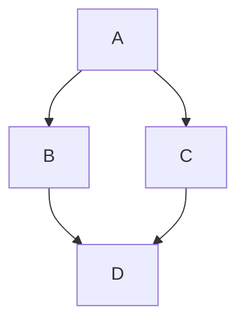

# 问题 
1.  OSPF的路由器重置Router-id后，需要重启OSPF进程才能更新router-ID。 这个会掉线和托管吧。isis好像不需要

路由协议没有不好， 只是看合不合适


# 题记
路由协议主要可以分位距离矢量路由协议和链路状态路由协议
距离矢量的代表有 RIP, EIGRP, BGP
链路状态路由协议有 OSPF, ISIS

路由协议作用是什么? 说白了就是在路由器之间传递消息, 使得网络中的路由器能够感知网络中的拓扑结构, 然后形成路由表. 当数据到达路由器之后, 可以通过查询路由表知道该从哪一个接口出去. 最终实现两个节点之间的通信.
要实现这个目的, 路由协议要回答的第一个问题就是选路. 基于什么标准来选路. 这种标准应该有一个可以量化的度量值. 

对于 RIP 来说这个度量值就是跳数
对于 EIGRP来说就是带宽, 跳数, 速率的一个计算值
对于 OSPF 也是类似EIGRP 的度量值
对于 BGP 是 AS 的跳数

为了

# RIP
如果是小的网络，可能跑RIP就够了。甚至静态路由
RIP协议是距离适量路由协议。 
### 缺点
1. 限制0-15跳。 一共16跳。 度量不科学
2. 只考虑跳数，没有考虑带宽。 OSPF是按照带宽去算的
3. **道听途说**， 缺乏整体网络的认知。 不能自主选路。只知道下一跳在哪里，但是不知道下一跳之后是不是通了
4. 所以，收敛速度慢，可扩展性差
RIP协议是，路由器不知道全网的设备状态，只是听别人说的。 如果别人发错了，就会出问题。 **毒性反转**， **水平分割**

水平分割： 收到的不会往外传的， 怎么做到防环？

OSPF链路状态路由协议

历史
首先是RIP， IGRP， EIGRP， OSPF

OSPF可以做备份联络，如果主线断了，能切到备份链路上，提高可靠性

总部和分支机构的连接
模式一： 
一条专线，一个vpn。 

现在vpn有软件和硬件。 但是软件不怎么赚钱，厂商现在卖硬件的设备。 
免费还有openvpn，但是生产环境不推荐

国内比较有名的是深信服

# 路由器
路由器会校验所有的接口的ip地址都是不同的。
广播是不会通过路由器的
所以现在大二层的方案不可取，因为二层广播会比较多
路由通告的方向和转发包的方向是相反的。 路由通告是一种承诺， 告诉其他的路由器，可以经过我走通道

OSPF特性
* 路由传递与路由计算是分离的
* 基于SPF Shortest Path First算法，算出来是二叉树，天然是防环的. 注意只找到最优的路径
* 已累计链路开销作为选路的参考值
* OSPF作为链路状态路由协议， 不直接传递各路由器的路由表，而传递链路状态信息，各路由器基于链路状态信息独立计算路由
* 在度量方式商，OSPF将链路带宽作为选路的参考依据


LSA 链路状态
每个交通路口都有摄像头， 把每个路口的拥堵情况都通告出来的了。将这些状态信息放进每台路由器的LSDB数据库，然后通过SPF算法来计算最优路径
这里是累计链路开销。也就是自己到目的地址这么多跳的累计带宽开销。而不是按照条数来的。


链路状态信息有哪些
* 每个LSA都有route_id表示那个设备传来的
* 链路类型： 串行链路， ATM， 帧中继发展到以太网， OTN， xPON, SDH, MSTP
* 该接口的IP地址及掩护
* 接口的带宽
* 接口所连接的邻居


OSPF的工作过程
1. 邻居建立
2. 同步链路状态数据库
3. 计算最优路由
Notes： 邻接比邻居高级

注意：

# 链路负载解决方案
1. OSPF计算的是最优路径, 如果如下图， A-B-D是最优路径，那么所有流量都走B，不会走C
如果要让做链路的负载，可以用MPLS TE 流量工程，来匹配业务。
2. 使用双路由平面, 也就是A-B-D用OSPF, ACD用isis。 然后用policy acl来匹配



学会查看3个表
1. ospf路由表
2. dis ip routing table 路由器的路由表
3. 路由器的转发表

OSPFv2是ipv4的V3是ipv6

* router-id通常建议手工配置, 一般使用loopback地址。如果没有配置，则从loopback口中选ip最大的作为router-id。如果没有loopback口，则从物理接口中选ip地址最大的
* router-id只是一个标识，但是竞选DR， BDR有影响
* 使用loopback地址是因为，loopback始终是存在， 不会因为接口shutdown了，就ping不通


```shell
# cisco 重启进程
clear ip ospf 1 process
# huawei
reset ospf process
```
一个设备上是可以配两个ospf进程的。 但是就是用两套内存，可以认为是双路由平面，但是一般不这么做

Hello报文作用
* 邻居发现
* 邻居建立，协商参数。如果参数不一致，建立邻居失败
* 邻居保持： 通过keepalive机制（保活机制），检测邻居运行状态。 一段时间没有收到hello报文，就是死了

邻居的状态
down
init
two-way, 发送的hello报文中有邻居的router-id，对方接受到后，状态设置为two-way

因为邻居是未知的，所以Hello报文的目的不是某个特定的单播地址，而是目的地址为224.0.0.5的组播。
对于不支持组播的网络 OSPF路由器如何发现邻居？使用单薄的方式手工建立邻居
```shell
ospf 1
peer 2.2.2.2  # 一般在帧中继中使用，静态指定。现在已经不用了
```


# OSPF和RIP的区别
* OSPF同步的是最原始的链路状态信息，对于邻居发过来的LSA，仅作转发。最后所有的路由器都将拥有一份相同且完整的原始链路状态信息（区域内部）
* 区域之间传输的还是可能是路由信息


# 网络类型
网络类型不同， hello包中的携带的参数也不一致。有时候是没有掩码的。

### P2P网络
* 仅两台路由互联
* 支持广播，组播
### 广播型网络 （以太网）
* 两台或者两台以上路由器通过共享介质互联
* 支持广播，组播
### NBMA网路 很少用
全部互联的帧中继。多个设备接到一个交换机
* 两台或者两台以上路由器通过VC互联
* 不支持广播，组播
# P2MP 点到多点
没有全互联， 类似组长带小兵
没有任何一宗链路层协议默认属于P2MP类型网络，也就说必须是由其他的网络类型强制更改为P2MP, 常见的作法是将非完全连接的帧中继或者ATM改为P2MP网络
* 支持广播，组播

OSPF度量方式
* 某接口cost = 参考带宽/实际带宽 范围 1-65535
* 更改cost的两种方法
	* 直接在接口下配置
	* 修改参考带宽（所有路由器都需要修改，保持选路的一致性）
* 默认参考带宽是百兆的带宽 10^8， 所以cost = 1^8 / 实际带宽, 小于1的算作是1
	* 如果是2M线，cost就是50
	* 如果是千兆先， cost就是1
	* 但是千兆和万兆线区分不开，都是1，这种时候就要手工指定cost值。因为设备一般是有限选择cost值， 不自己计算了cost了
* 因为OSPF是累计的带宽，所以同时考虑了条数和带宽
OSPF路由器怎么表达链路状态信息并完成同步

配置方式
```shell
# 在接口下
ospf cost 100  # 如果要选路，一般是一边选50， 另一边选100. 两个数差距不要太小
bandwidth 2000 # 2兆带宽， 但因为配置了cost 100， 这条命令不会起作用
```

端口号
OSPF 协议报文头部
OSPF协议号89
RIP协议的协议号是520
UDP 17
VRRF 112
BGP TCP 179
DHCP 68 67
DHCPv6 546 547
ftp 20 21  # 20是管理端口，21是数据端口，做acl的时候都需要配置
SSH 22
telnet 23
BFD UDP 3784
DNS 53 TCP UDP
vxlan 外层4789
SNMP 161 162
SMTP 25
Oracle 1521
MySQL 3306
MS SQL Server 1433

# 选举
OSPF DR BDR选举， router-id 越大越好
BGP router-id 选举， 物理接口IP地址越大越好

VLAN PRI 值越大越好
VRRP 优先级越大越好，优先级一样时，实际接口IP地址越大优先级越高

OSPF的组播地址 224.0.0.5 224.0.0.6
RIPv2的组播地址 224.0.0.9
VRRP组播地址 224.0.0.18

交换机里的选举
LACP （Eth-Trunk) 值越小越好

# 唯一的
1. OSPF的router-id在要给Area区域内都是必须唯一的
2. 在整个BGP网络中，每台BGP设备路由器ID都必须是唯一的。 可以手工配置，也可以让BGP自己在设备上选取。自动选举时，BGP设备选择设备上的loopback地址作为BGP的router-id。如果没有手工配置，也没有loopback地址时，优先选择物理接口中最大的IP地址。一旦选出路由器ID，除非发生接口地址删除等事件。否则即使配置了更大的接口的IP地址，也会保持原来的路由器ID


ospf可以配置认证信息


各种网络类型下是否和邻居建立邻接关系
建立邻接关系需要通过LSDB，如果是两两互联的网络， 有 n*(n-1) /2 条链路。全部同步LSA报文会造成LSA泛洪。造成网络拥塞。 所以会选举DR Designed Router，为了避免DR的单点故障。 DR选举完之后会向DRother设备发送LSA，此时的拓扑就是星型结构。

|网络类型|是否和邻居建立邻接关系|
|--|--|
|P2P|是|
|Broadcast|DR与BDR，DRother建立邻接关系， BDR与DR， DRother建立邻接关系,DRother之间只建立邻居关系|
|NBMA|同上|
|P2MP|是|


### 选举DR/BDR 过程
选举是在双方都进入2-way状态之后进行的。从hello报文中获得的信息。 选举完之后进入ExStart状态
1. 先把不想当的剔除
2. 从想当BDR中的设备选一个出来当DR
3. 在剩余的BDR设备中再选一台BDR

在建立邻居的过程中master和slave与DR和BDR没有关系
Master指发出LSA信息的一方， 可以是DR/BDR或者是DRother
比如我今天新接入网络几台设备， 这些设备会向DR和BDR发送链路信息， 此时这些新设备就是Master